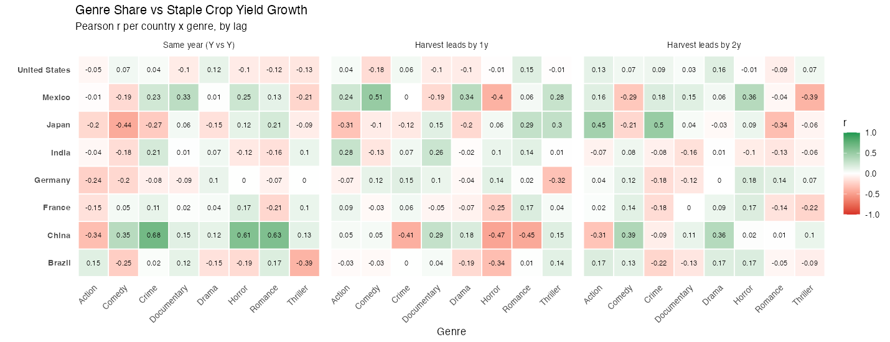
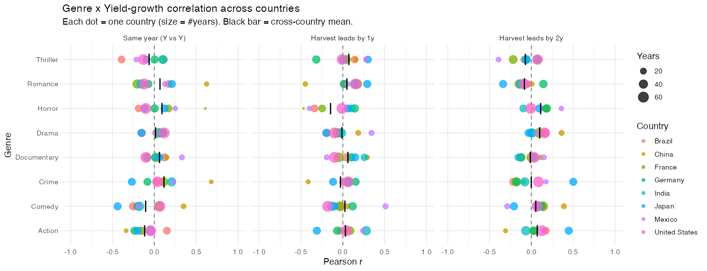
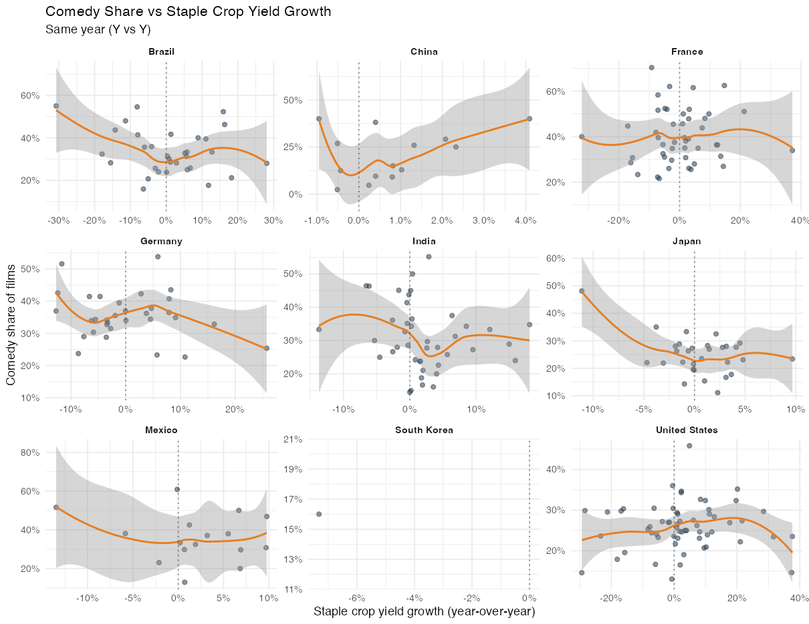
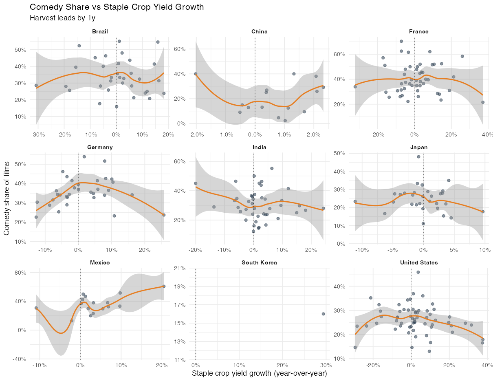
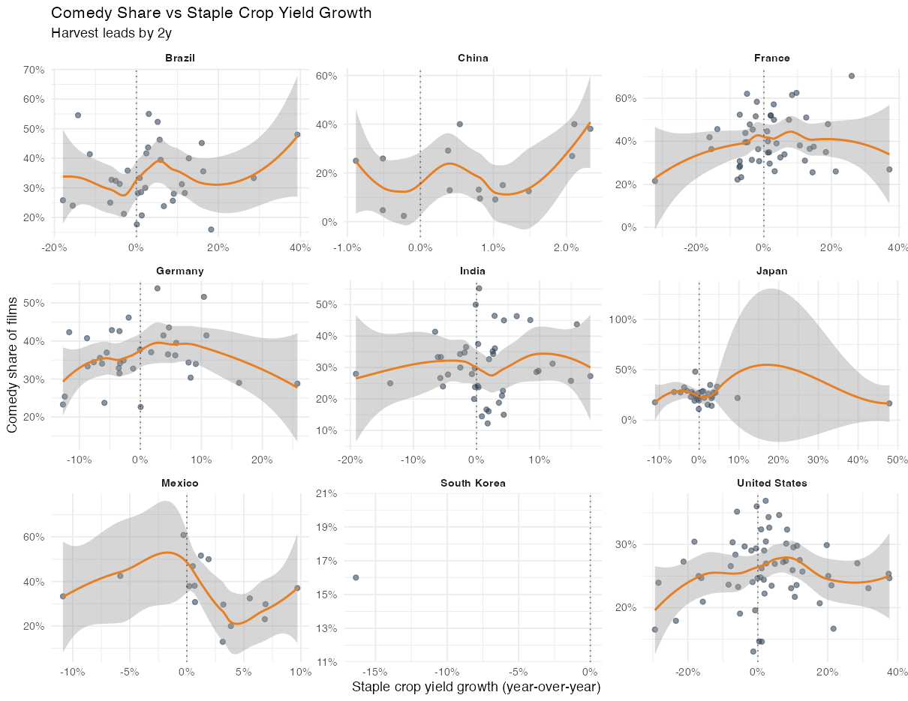

# Analysis 1 — Do Movie Genres Shift With the Harvest?

**Genre share vs. staple-crop yield growth across 8 major film-producing countries**

---

## 1. The question

Does a country's mix of movie genres change with how good or bad its harvest was?
Three folk hypotheses motivated the analysis:

- **Escapism:** bad crop years → more **comedies**.
- **Reflection:** good crop years → more **dramas**.
- **Tension:** poor harvests → more **action**.

The plan: for each country and year, measure (a) how much the staple crop's yield
grew or shrank versus the previous year, and (b) what share of that year's films
fell into each genre — then see whether the two move together.

---

## 2. Data

| Source | What we used |
|---|---|
| **IMDB** (`title.akas`, `title.basics`, `title.ratings`) | Movie titles, release years, genres, and votes. |
| **FAOSTAT** | Annual crop **yield** (1961–2024) for Maize, Rice, Soybeans, Wheat. |

**Country of origin.** IMDB has no "production country" field, so we used a
distribution-footprint proxy: a film appearing in **≤ 3 distinct regions** is
treated as a domestic production, and that region is its country of origin. Ten
big producers were targeted: US, India, Brazil, China, Japan, Germany, France,
Nigeria, South Korea, Mexico.

---

## 3. Method and key decisions

**Vote threshold (the decision that unlocked the analysis).** The pipeline
originally kept only films with **≥ 500 votes** to make *ratings* reliable. But
Analysis 1 uses only **genre tags**, which don't need reliable ratings — a movie
is a comedy regardless of vote count. The 500-vote filter therefore needlessly
starved the data, leaving usable data for the **United States only**. Lowering
the floor to **≥ 50 votes** (a light spam filter) recovered **8 countries** at no
quality cost. This produced **22,395** domestic movie-country records.

**Staple crop (hand-picked).** FAOSTAT supplied only four crops. Choosing the
staple by "highest yield per hectare" mislabeled almost every country as Rice
(rice has high yield/ha), so each country's dominant crop was assigned by real
agricultural importance:

| Maize | Rice | Soybeans | Wheat |
|---|---|---|---|
| US, Mexico, Nigeria | India, China, Japan, S. Korea | Brazil | Germany, France |

**Yield growth.** To avoid the classic spurious-trend trap (both crop yields and
film output drift upward over decades), yield was converted to **year-over-year
% growth** — a detrended measure comparable across countries.

**Genre share.** For each country-year, a genre's share = (distinct films tagged
with that genre) ÷ (distinct films that year). Because films carry multiple
genre tags, shares need not sum to 100%.

**Noise filter.** Country-years with **< 20 films** were dropped — their shares
swing wildly on a single film. After filtering, usable years per country:

| US | France | India | Germany | Brazil | Japan | Mexico | China |
|---|---|---|---|---|---|---|---|
| 72 | 48 | 43 | 34 | 33 | 30 | 16 | 15 |

(South Korea had only 1 usable year and was excluded.)

**Timing (lags).** Films released in year *Y* were written and shot 1–3 years
earlier, so a harvest cannot affect *that same year's* slate. We therefore tested
**three lags**: same-year, harvest-leads-by-1-year, and harvest-leads-by-2-years.

---

## 4. Results

### 4a. Individual country-genre correlations look striking…

Computing one Pearson *r* per country × genre × lag produced some strong-looking
values:

| Lag | Country | Genre | r | years |
|---|---|---|---|---|
| Same year | China | Crime | **0.68** | 10 |
| Same year | China | Romance | 0.63 | 12 |
| Same year | China | Horror | 0.61 | 7 |
| +1 year | Mexico | Comedy | 0.51 | 16 |
| +2 years | Japan | Crime | 0.50 | 29 |

*Figure 1. Pearson r for every country × genre, by lag. Plenty of color — but the
pattern is inconsistent: the same genre is red in one country and green in another.*

### 4b. …but they do not survive a cross-country test.

The honest question is not "is there a strong cell somewhere?" (with ~360
correlations, a few large ones are guaranteed by chance) but **"does a genre move
with yield in the same direction across countries?"** Averaging each genre's *r*
across all 8 countries collapses everything to near zero:

*Figure 2. Each dot is one country's correlation; the black bar is the
cross-country mean. Every genre's dots straddle zero — no genre's mean is
meaningfully different from 0.*

**Cross-country average correlation (|mean r|), by genre and lag — all small,
none significant (p > 0.05):**

| Genre | Same-yr | +1y | +2y | Consistent sign? |
|---|---|---|---|---|
| Drama | +0.02 | −0.01 | +0.10 | No |
| Comedy | −0.10 | +0.03 | +0.05 | No |
| Action | −0.11 | +0.04 | +0.07 | No |
| Horror | +0.09 | −0.15 | +0.11 | No |
| Crime | +0.12 | −0.02 | +0.00 | No |
| Romance | +0.07 | +0.05 | −0.08 | No |
| Thriller | −0.06 | +0.07 | −0.07 | No |
| Documentary | +0.06 | +0.06 | −0.01 | No |

Every genre **changes sign** as the lag changes — the fingerprint of noise, not a
relationship. The two mildest near-misses (Drama at +2y: 7/8 positive, p≈0.06;
Action same-year: 7/8 negative, p≈0.08) both **vanish at the other lags**, so
neither holds together as a story.

The comedy hypothesis (the headline idea) is unsupported at every lag:

*Figure 3. Comedy share vs. staple-yield growth, faceted by country, at each lag.
The LOESS curves are flat-to-wandering with wide confidence bands — no consistent
slope in either direction.*

---

## 5. Why the strong correlations disappear (multiple comparisons)

A single country-genre correlation is fit over very few years (China: ~10). With
so few points, random scatter can line up by luck — with *n* = 10, a correlation
of 0.63 occurs about 5% of the time from pure noise. Because we computed roughly
**8 genres × 8 countries × 3 lags ≈ 360 correlations**, we should *expect* on the
order of 18 "significant-looking" values even if no real relationship exists.

**A worked example — Crime, same-year, all 8 countries:**

| Country | r | years |
|---|---|---|
| **China** | **+0.68** | **10** |
| Mexico | +0.23 | 12 |
| India | +0.21 | 40 |
| France | +0.11 | 40 |
| United States | +0.04 | 60 |
| Brazil | +0.02 | 29 |
| Germany | −0.08 | 29 |
| Japan | −0.27 | 29 |
| **Average** | **+0.12** | 6 positive, 2 negative |

The decisive detail: the country with the **largest** correlation (China, +0.68)
also has the **fewest years** (10), while every country with a long record
(US 60, France 40, India 40, Japan 29) sits between −0.27 and +0.21. The standout
value comes from the smallest, noisiest sample. A genuine harvest→genre effect
would make *most* countries lean the same way; instead the eight correlations are
independent draws scattered around zero, and averaging them collapses the
"relationship" to +0.12 — not statistically distinguishable from zero. China's
0.68 was not a signal; it was the luckiest of many rolls of the dice.

---

## 6. Conclusion

> Across 8 countries and 3 timing assumptions, **no film genre's share shows a
> systematic relationship with staple-crop yield growth.** All 24 cross-country
> average correlations fall within |r| ≤ 0.15, none is statistically significant,
> and no genre maintains a consistent sign across lags. Individual country-genre
> correlations reached as high as 0.68 but failed to replicate across countries or
> lags — consistent with chance under many simultaneous comparisons rather than a
> real harvest→genre link.

None of the three hypotheses (escapism comedies, good-year dramas, poor-harvest
action) is supported. This is a clean negative result: the tempting individual
correlations were shown to be statistical mirages.

---

## 7. Limitations

- **Origin proxy.** The "≤ 3 regions = domestic" rule excludes widely-distributed
  films and biases the US sample toward smaller releases.
- **Thin coverage** for China, Mexico (~15 years) makes their individual
  correlations unstable — the very reason they dominated the "strongest" list.
- **Only 4 crops** were available; the true economic staple (e.g., sugarcane in
  Brazil, cassava in Nigeria) was not in the data.
- **Plausibility.** For most of these countries, agriculture and cinema are
  economically disconnected, so a null result is unsurprising — and correctly
  found.
