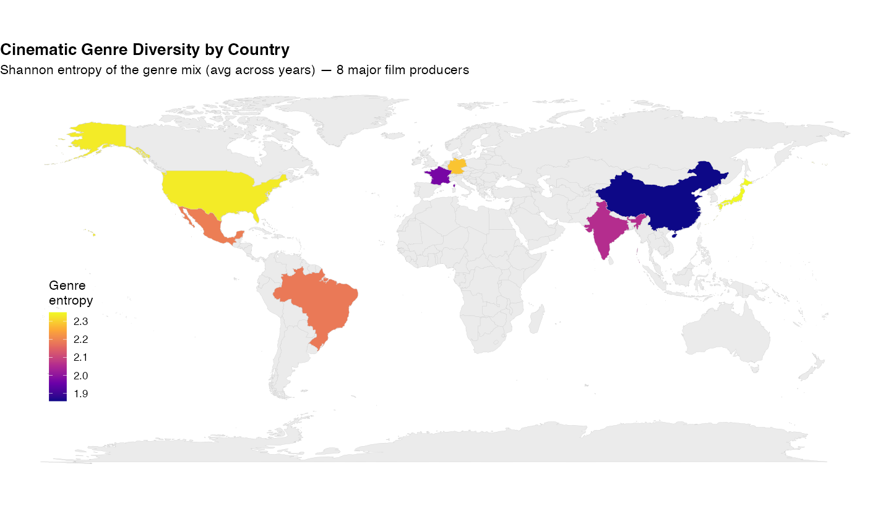
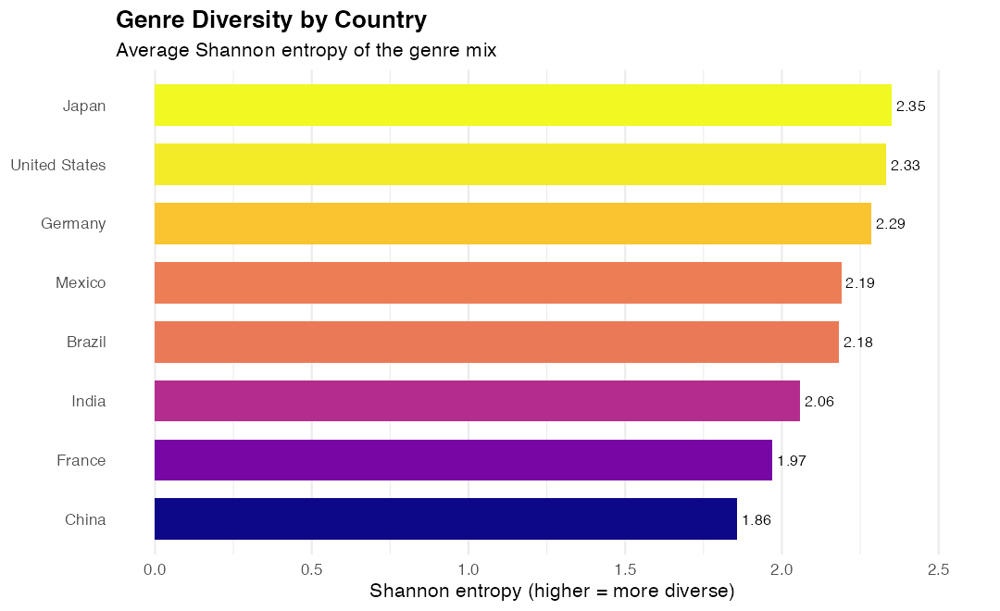
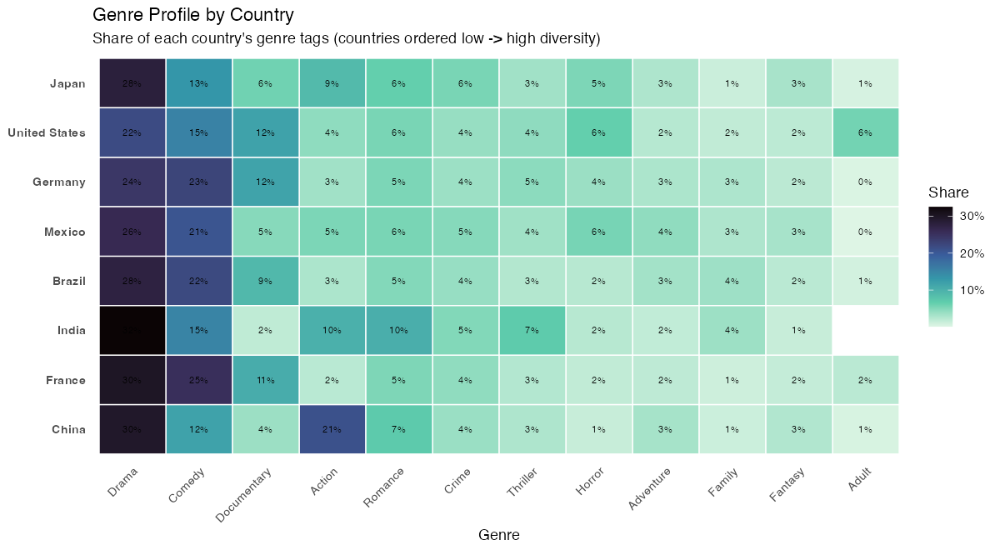
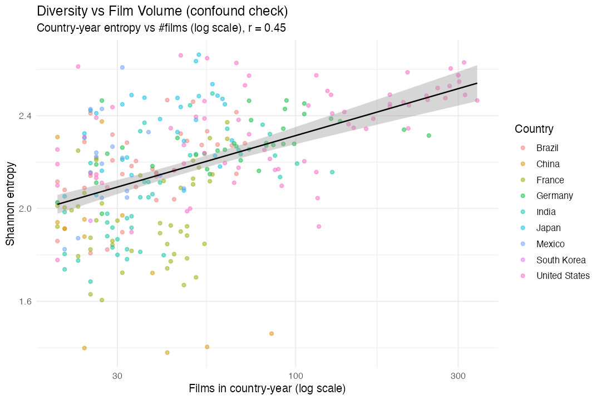
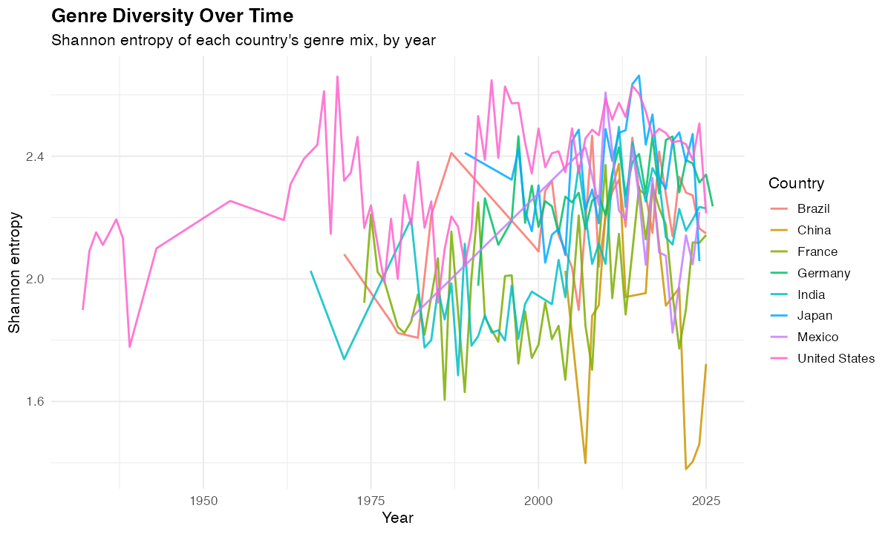
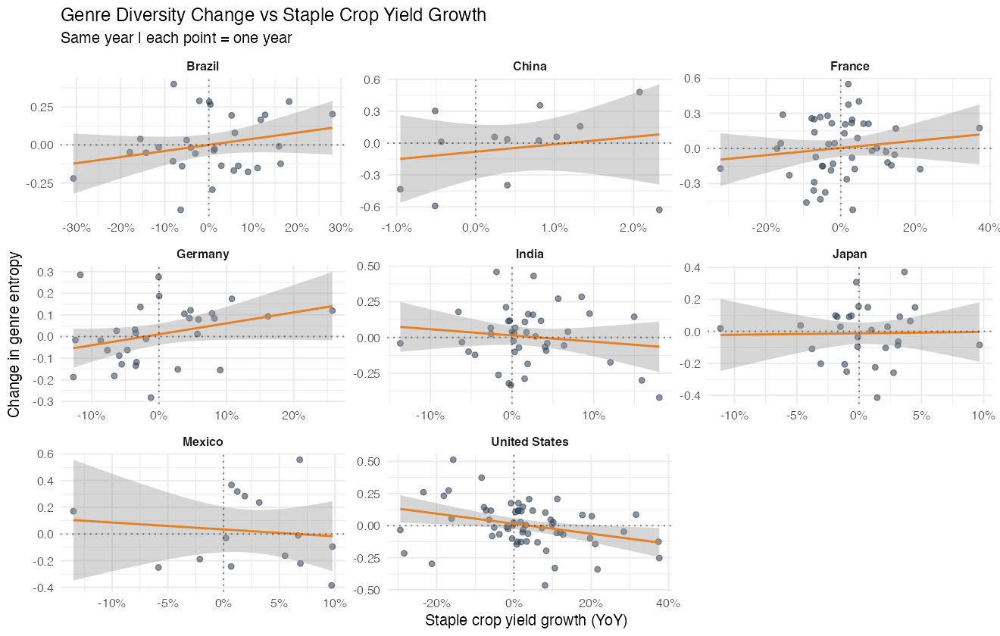

# Analysis 2 — How Diverse Is a Country's Cinema?

**Genre diversity (Shannon entropy) across 8 major film-producing countries — and whether it tracks the harvest**

---

## 1. The questions

After Analysis 1 found that *individual* genres don't respond to crop yields, Analysis 2
steps back and asks about the **whole genre mix** at once:

- **(A) Descriptive:** Which countries make the most genre-diverse cinema, what drives
  those differences, and is diversity changing over time?
- **(B) Crop link:** Do countries make *more diverse* films after good harvests?

**Diversity metric — Shannon entropy.** For each country-year we take every (film, genre)
tag, compute each genre's share *pᵢ*, and calculate

> H = − Σ pᵢ · ln(pᵢ)

Higher H = output spread evenly across many genres; lower H = output concentrated in a
few. We also report **evenness** (H ÷ ln(richness), which removes the effect of *how many*
genres exist) and **richness** (the count of distinct genres).

---

## 2. Method

Same data hygiene as Analysis 1:

- Films from `df_genre` — domestic productions (≤3 distribution regions) with **≥ 50 votes**.
- Country-years with **< 20 films dropped** (entropy is unstable on small slates).
- 8 countries clear the bar with ≥ 5 usable years: US, Japan, Germany, France, India,
  Brazil, Mexico, China. (South Korea and Nigeria too thin.)
- Crop test uses each country's hand-picked staple yield as **year-over-year % growth**
  (detrended), correlated against the **year-over-year change in entropy**, same-year and
  at a 2-year lag, then aggregated across countries — exactly the method trusted in A1.

---

## 3. Results — descriptive

### 3a. The diversity ranking

| Rank | Country | Entropy | Evenness | Richness | Years |
|---|---|---|---|---|---|
| 1 | Japan | 2.35 | 0.85 | 16.0 | 30 |
| 2 | United States | 2.33 | 0.81 | 18.1 | 72 |
| 3 | Germany | 2.29 | 0.81 | 17.1 | 34 |
| 4 | Mexico | 2.19 | 0.84 | 13.8 | 16 |
| 5 | Brazil | 2.18 | 0.82 | 14.7 | 33 |
| 6 | India | 2.06 | 0.81 | 13.1 | 43 |
| 7 | France | 1.97 | 0.78 | 13.0 | 48 |
| 8 | China | 1.86 | 0.77 | 11.5 | 15 |

**Japan, the United States, and Germany** (effectively tied at the top) produce the most
genre-balanced cinema; **France and China** the most concentrated. The spread is modest
(1.86–2.35) — every industry is reasonably broad — but the ends are meaningful.

*Figure 1. Average genre diversity by country (8 producers shaded; others have no data).*

*Figure 2. The precise ranking behind the map.*

### 3b. Why? Every cinema is Drama-led — they differ in how hard they lean in

The single most common genre is **Drama in all 8 countries**. What differs is *how
dominant* it is — and that lines up almost exactly with the diversity ranking:

| Country | Drama share | Diversity |
|---|---|---|
| India | 32.5% | low |
| France | 30.0% | low |
| China | 29.6% | lowest |
| Japan | 28.0% | highest |
| Brazil | 27.6% | mid |
| Mexico | 26.2% | mid |
| Germany | 24.3% | high |
| United States | 21.7% | high |

Low-diversity countries concentrate ~30–33% of their output in Drama; high-diversity ones
hold Drama to ~22–24% and spread the rest across many genres. (India being the *most*
Drama-concentrated matches Bollywood's well-known lean toward drama/romance.) **Japan** is
the instructive exception: its Drama share is mid-pack, but it distributes everything else
so evenly (highest evenness, 0.85) that it tops the ranking.

*Figure 3. Each country's genre "fingerprint" — share of genre tags, countries ordered
low→high diversity. The concentration into Drama (and a few neighbors) at the bottom vs.
the even spread at the top is the visual story.*

### 3c. Is this just "bigger industries make more genres"? Partly.

Diversity is **moderately correlated with film volume** (entropy vs. number of films:
*r* = 0.45 per country-year, 0.53 across countries). So part of the ranking does reflect
that larger slates mechanically show more genres. But it is **not only** volume:

- The **US makes the most films yet ranks #2**, behind Japan — pure volume would put it first.
- **Evenness**, which is mathematically independent of how many genres appear, gives the
  same qualitative ordering (Japan/Mexico most even; China/France least).

So the ranking is part scale, part genuine composition — and the composition differences
survive once scale is removed.

*Figure 4. The confound check: entropy rises with film count (r = 0.45), but loosely —
volume explains only ~20% of the variation.*

### 3d. Cinema is getting more diverse over time

Fitting entropy against year for each country, **7 of 8 show rising diversity**
(~+0.05 to +0.10 entropy per decade), consistent with maturing, globalizing film
industries. India rose fastest (+0.10/decade).

| Trend (entropy / decade) | Countries |
|---|---|
| Rising | India (+0.10), Germany (+0.06), Brazil (+0.06), Japan (+0.06), US (+0.05), France (+0.04), Mexico (+0.02) |
| Falling | China (−0.19) |

China's decline is the lone exception, but rests on only 15 recent years — likely noise
rather than a real reversal, and flagged as such.

*Figure 5. Genre entropy by year and country.*

---

## 4. Results — the crop link (null)

Correlating year-over-year **change in diversity** against **staple-crop yield growth**,
then averaging across the 8 countries:

| Lag | mean r | sign split | p |
|---|---|---|---|
| Same year | +0.04 | 5 + / 3 − | 0.59 |
| Harvest leads 2y | −0.05 | 3 + / 5 − | 0.44 |

Both averages are essentially zero, neither is significant, and the sign flips between
lags. Individual countries scatter inconsistently (e.g. Brazil +0.25 same-year but −0.35
at the 2-year lag). **Genre diversity does not track the harvest** — the same clean null
as Analysis 1.

*Figure 6. Year-over-year diversity change vs. staple yield growth, by country. Flat,
inconsistent slopes.*

---

## 5. Conclusion

- **Genre diversity differs meaningfully across countries** — Japan, the US, and Germany
  are the most genre-balanced; France and China the most concentrated.
- **The driver is how hard a country leans into Drama:** every cinema is Drama-led, but
  low-diversity countries pour ~⅓ of output into it while high-diversity ones cap it near
  ⅕ and spread the rest.
- **Diversity has risen over time** in nearly every country.
- Part of the ranking reflects industry **scale** (r ≈ 0.5 with film volume), but the
  compositional differences are real and survive an evenness adjustment.
- **Crop yields have no detectable relationship with genre diversity** — reinforcing
  Analysis 1's finding that agriculture and cinema move independently.

Together with Analysis 1, the project tested the crop→cinema idea from two angles (single
genres and overall diversity) and found no link either way — while still surfacing a
genuine, well-explained pattern in *how* national cinemas differ.

---

## 6. Limitations

- **Film-count sensitivity.** Entropy correlates with volume (r ≈ 0.5); evenness is the
  more scale-robust read and is reported alongside it.
- **Thin samples.** China (15 yrs) and Mexico (16 yrs) give noisier estimates; China's
  negative time trend in particular should not be over-read.
- **IMDB genre tags** are crowd-sourced and US-centric, and the ≤3-region origin proxy
  biases samples toward smaller domestic releases — both may compress measured diversity.
- **Only the same 8 countries** clear the data thresholds, so the map is sparse.
